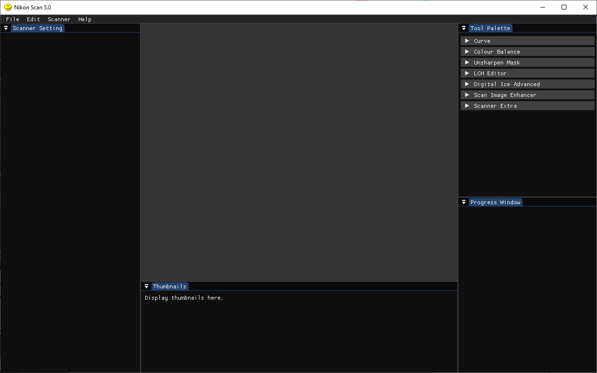

# Nikon Scan 5.0

This is an attempt to create a new version of the Nikon Scan software that will be compatible with all versions of the Nikon CoolScan scanner. 
In the proces of doing so the Nikon Scan 4 software that Nikon has dropped support for will be reverse engineered, the legality of that is in question and I dont have the resources to ask a lawyer so *proceed at your own peril*.

This is currently in development and does not work, I work on it when I have time to do so. If you'll like to see development move faster, contribute.

### Current state
 

## Some Notes
The *binaries* directory contain the current NikonScan4 software for easy of reverse engineering. That version of NikonScan4 works on windows 10 (with a driver update created by some guy on the internet. I know scary shit downloading driver update from some guy on the internet but I have ran it through virustotal and hybrid-analysis and no foul play was detected, yet again *proceed at your own peril*) albeit crashes once out of 15 successful runs.

The *docs* directory contain sample images of what the software looks like running.
